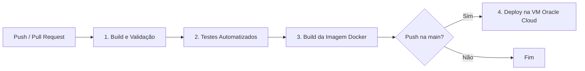

# ☁️ Projeto Integrador — Cloud & DevOps


## 🌐 Aplicação

🔗 **Acesse:** https://devopszahara.duckdns.org

## 📑 Seções

1. [Descrição da aplicação](#1-descrição-da-aplicação)
2. [Arquitetura do ambiente](#2-arquitetura-do-ambiente)
3. [Tecnologias utilizadas](#3-tecnologias-utilizadas)
4. [Estrutura do projeto](#4-estrutura-do-projeto)
5. [Processo de instalação](#5-processo-de-instalação)
6. [Processo de deploy](#6-processo-de-deploy)
7. [Configuração do Docker](#7-configuração-do-docker)
8. [Configuração do DNS](#8-configuração-do-dns)
9. [Configuração do HTTPS](#9-configuração-do-https)
10. [Processo de CI/CD](#10-processo-de-cicd)
11. - [Monitoramento](#11-monitoramento)
12. - [Procedimentos básicos de recuperação](#12-procedimentos-básicos-de-recuperação)

## 1. Descrição da aplicação

--> O projeto consiste em uma aplicação web desenvolvida para a disciplina de DevOps e Computação em Nuvem do curso de Ciência da Computação da Afya São Lucas. A aplicação foi desenvolvida com o objetivo de colocar em prática conceitos de desenvolvimento de software, controle de versão, containerização e implantação de aplicações em um ambiente de nuvem. A nossa aplicação apresenta uma página web responsiva com informações sobre o projeto e seus integrantes, sendo disponibilizada publicamente na internet por meio de uma infraestrutura hospedada na Oracle Cloud. O nosso sistema utiliza tecnologias web como HTML5, CSS3, JavaScript e Bootstrap, permitindo a apresentação e interação com o conteúdo da aplicação. Além do desenvolvimento da interface, o projeto busca demonstrar na prática um fluxo de DevOps, envolvendo versionamento do código com Git e GitHub, execução da aplicação em containers Docker, infraestrutura em nuvem, configuração de domínio, acesso seguro por HTTPS, automação de implantação e monitoramento. Sendo assim, projeto integra o desenvolvimento da aplicação com práticas de Cloud Computing e DevOps, desde a criação e versionamento do código até a disponibilização e manutenção.


## 2. Arquitetura do ambiente

--> A aplicação está hospedada em uma máquina virtual na Oracle Cloud, utilizando o sistema operacional Ubuntu Linux. O código-fonte é armazenado e versionado no GitHub, enquanto o Docker é utilizado para realizar a conteinerização e execução da aplicação. O acesso à aplicação é realizado por meio de um domínio configurado no serviço de DNS, que direciona o domínio para o endereço IP público da máquina virtual, e a comunicação com a aplicação é realizada por HTTP e HTTPS.

--> O fluxo geral da arquitetura é representado abaixo:

```text
Desenvolvedor
      |
      v
    Git
      |
      v
   GitHub
      |
      v
GitHub Actions
      |
      v
    Deploy
      |
      v
Oracle Cloud
 Ubuntu Linux
      |
      v
    Docker
      |
      v
  Container
      |
      v
 Aplicação
      ^
      |
     DNS
      ^
      |
   Usuário
```

## 3. Tecnologias utilizadas

--> Para o desenvolvimento, hospedagem e gerenciamento da aplicação, foram utilizadas diferentes tecnologias e ferramentas, a tabela a seguir apresenta as principais tecnologias utilizadas:

|  Tecnologia/Ferramenta      |            Utilização no projeto              |
| :-------------------------- | :-------------------------------------------- |
| **HTML5**                   | Estrutura da aplicação web                    |
| **CSS3**                    | Estilização e aparência         |
| **Git**                     | Controle e versionamento do código            |
| **GitHub**                  | Armazenamento e gerenciamento do código-fonte |
| **Docker**                  | Containerização da aplicação                  |
| **Docker Compose**          | Gerenciamento da aplicação em containers      |
| **GitHub Actions**          | Automação do processo de CI/CD                |
| **Oracle Cloud**            | Hospedagem da infraestrutura em nuvem         |
| **Ubuntu Linux**            | Sistema operacional da máquina virtual        |
| **DuckDNS**                 | Configuração e gerenciamento do DNS           |
| **Let's Encrypt / Certbot** | Configuração do certificado HTTPS/SSL         |
| **Uptime Kuma**             | Monitoramento da disponibilidade da aplicação |
| **Visual Studio Code**      | Desenvolvimento e edição do código            |


## 4. Estrutura do projeto

--> O projeto está organizado em arquivos responsáveis pela aplicação web, configuração do servidor, containerização, automação do deploy, controle de arquivos e documentação. Essa organização permite separar os arquivos da aplicação das configurações utilizadas na infraestrutura e no processo de CI/CD.

--> A estrutura principal do projeto é apresentada abaixo:

```text
Devops-N1/
├── .github/
│   └── workflows/
│       └── deploy.yml
├── .gitignore
├── Dockerfile
├── README.md
├── default.conf
├── docker-compose.yml
├── index.html
├── script.js
└── style.css
```

### Principais arquivos e diretórios

| Arquivo/Diretório    | Função                                                                                               |
| :------------------- | :--------------------------------------------------------------------------------------------------- |
| .github/workflows/ | Diretório que armazena os arquivos de workflow utilizados pelo GitHub Actions                       |
| deploy.yml         | Arquivo que define as configurações do processo de CI/CD e deploy automatizado                      |
| .gitignore         | Define arquivos e diretórios que não devem ser enviados para o repositório Git                      |
| Dockerfile         | Define as instruções utilizadas para construir a imagem Docker da aplicação                         |
| README.md          | Contém a documentação do projeto e suas configurações                                               |
| default.conf       | Contém a configuração personalizada do Nginx, incluindo HTTP, HTTPS e o redirecionamento para HTTPS. |
| docker-compose.yml | Define a configuração e o gerenciamento do container da aplicação                                   |
| index.html         | Contém a estrutura principal da aplicação web                                                       |
| script.js          | Contém os códigos JavaScript utilizados para funcionalidades e interações da aplicação.              |
| style.css          | Contém os estilos responsáveis pela aparência da aplicação                                          |


## 5. Processo de instalação

--> Para executar e disponibilizar a aplicação, é necessário preparar o ambiente de desenvolvimento e o servidor em nuvem. O projeto utiliza Ubuntu Linux como sistema operacional do servidor, além do Git, Docker e Docker Compose para gerenciamento e execução da aplicação.

### 5.1 Preparação do ambiente

--> Primeiramente, é necessário atualizar os pacotes do sistema operacional:

```bash
sudo apt update
sudo apt upgrade -y
```

--> Logo após, deve ser instalado o Git para realizar o versionamento e obter o código-fonte do projeto:

```bash
sudo apt install git -y
```

--> Após a instalação, o repositório do projeto pode ser clonado:

```bash
git clone URL_DO_REPOSITORIO
cd Devops-N1
```

### 5.2 Instalação do Docker

--> O Docker é utilizado para criar e executar o container responsável pela aplicação, logo após a instalação é possível verificar se o serviço está funcionando com:

```bash
docker --version
```

### 5.3 Execução da aplicação

--> Com o ambiente preparado e o código-fonte disponível no servidor, a aplicação pode ser iniciada utilizando o Docker Compose:

```bash
docker compose up -d
```

--> Após a execução, o container pode ser verificado com:

```bash
docker ps
```

--> Com o container em execução, a aplicação estará disponível conforme as configurações de rede e portas definidas no projeto.

## 6. Processo de deploy

--> O processo de deploy é responsável por disponibilizar a aplicação no ambiente de produção, e neste projeto, a aplicação é enviada para uma máquina virtual na Oracle Cloud, onde é executada em um container Docker, o processo ocorre desde o envio do código-fonte para o GitHub até a execução da aplicação no servidor.

### 6.1 Fluxo do deploy

--> O fluxo de deploy da aplicação pode ser representado da seguinte forma:

```text
Desenvolvedor
      ↓
Código da aplicação
      ↓
Git / GitHub
      ↓
Servidor Oracle Cloud
      ↓
Docker
      ↓
Container
      ↓
Aplicação disponível
```

### 6.2 Envio do código para o GitHub

--> Após o desenvolvimento e as alterações na aplicação, o código é versionado utilizando o Git e enviado para o repositório do projeto no GitHub:
```
git add .
git commit -m "Atualiza aplicação"
git push
```

### 6.3 Atualização da aplicação no servidor

--> No servidor da Oracle Cloud, o código atualizado é obtido a partir do repositório:
```
git pull
```
--> Após a atualização dos arquivos, a aplicação é reconstruída e executada utilizando o Docker Compose:
```
docker compose down
docker compose up -d --build
```
--> O parâmetro --build permite reconstruir a imagem Docker utilizando os arquivos atualizados do projeto.

### 6.4 Verificação da aplicação

--> Após o deploy, é possível verificar se o container foi iniciado corretamente:
```
docker ps
```
--> Com o container em execução, a aplicação fica disponível para acesso por meio do endereço configurado no projeto.

## 7. Configuração do Docker

--> O Docker foi utilizado para realizar a containerização da aplicação web, permitindo que ela seja executada de forma isolada e padronizada no servidor da Oracle Cloud, a configuração é composta pelo Dockerfile e pelo docker-compose.yml, responsáveis pela criação da imagem e pelo gerenciamento do container.

### 7.1 Dockerfile

--> O projeto possui um arquivo Dockerfile, que define as instruções utilizadas para construir a imagem Docker da aplicação.

--> A configuração utilizada é:

```dockerfile
FROM nginx:alpine

COPY index.html /usr/share/nginx/html/index.html

COPY style.css /usr/share/nginx/html/style.css

EXPOSE 80

CMD ["nginx", "-g", "daemon off;"]
```

--> Principais instruções:

| Instrução                                          | Função                                                                        |
| :------------------------------------------------- | :---------------------------------------------------------------------------- |
| FROM nginx:alpine                               | Utiliza o Nginx baseado no Alpine Linux como imagem base do container      |
| `COPY index.html /usr/share/nginx/html/index.html | Copia o arquivo principal da aplicação para o diretório utilizado pelo Nginx |
| COPY style.css /usr/share/nginx/html/style.css   | Copia o arquivo de estilos para o diretório utilizado pelo Nginx             |
| EXPOSE 80                                        | Indica que a aplicação utiliza a porta 80 no container                      |
| CMD ["nginx", "-g", "daemon off;"]               | Inicia o Nginx em primeiro plano, mantendo o serviço ativo no container      |

### 7.2 Docker Compose

--> O arquivo docker-compose.yml é utilizado para definir e gerenciar a execução do container da aplicação.

--> A configuração utilizada no projeto é:

```yaml
version: '3.8'

services:
  web:
    build: .
    container_name: site-devops
    ports:
      - "80:80"
      - "443:443"
    volumes:
      - ./default.conf:/etc/nginx/conf.d/default.conf:ro
      - /etc/letsencrypt:/etc/letsencrypt:ro
    restart: always
```

--> As principais configurações são:

| Configuração                  | Função                                                                            |
| :---------------------------- | :-------------------------------------------------------------------------------- |
| version: '3.8'              | Define a versão utilizada na configuração do Docker Compose                      |
| services                    | Define os serviços que serão executados pelo Compose                             |
| web                         | Identifica o serviço responsável pela aplicação                                  |
| build: .                    | Indica que a imagem será construída utilizando o Dockerfile do diretório atual |
| container_name: site-devops | Define o nome do container da aplicação                                          |
| 80:80                       | Mapeia a porta 80 do servidor para a porta 80 do container                       |
| 443:443`                     | Mapeia a porta 443 do servidor para a porta 443 do container                     |
| ./default.conf              | Monta a configuração personalizada do Nginx dentro do container                  |
| /etc/letsencrypt            | Disponibiliza os certificados do Let's Encrypt para o Nginx                      |
| :ro                         | Define os volumes como somente leitura dentro do container                       |
| restart: always             | Configura o reinício automático do container caso ele seja interrompido          |

### 7.3 Execução do container

--> Após a configuração dos arquivos, a imagem pode ser construída e o container iniciado com:

```bash
docker compose up -d --build
```

--> O parâmetro --build faz com que a imagem seja reconstruída utilizando as configurações atuais do projeto.

--> Para verificar se o container está em execução:

```bash
docker ps
```

--> Para consultar os logs da aplicação:

```bash
docker compose logs
```

--> Para interromper o container:

```bash
docker compose down
```

--> Dessa forma, o Docker permite que a aplicação seja executada de maneira padronizada no servidor, enquanto o Docker Compose facilita o gerenciamento do container e das configurações necessárias para seu funcionamento.


## 8. Configuração do DNS

--> O DNS foi configurado utilizando o serviço **DuckDNS**, que fornece um subdomínio gratuito para associar um nome de domínio ao endereço IP público da máquina virtual hospedada na Oracle Cloud.

--> Foi utilizado o seguinte domínio:

```text
devopszahara.duckdns.org
```

--> O subdomínio foi configurado diretamente no DuckDNS, associando-o ao endereço IP público da máquina virtual:

```text
devopszahara.duckdns.org → 137.131.235.54
```

--> Dessa forma, quando um usuário acessa `devopszahara.duckdns.org`, o DNS realiza a resolução do domínio para o endereço IP da máquina virtual, permitindo que a aplicação seja localizada por meio de um endereço de domínio.

### 8.1 Funcionamento do DNS

--> O funcionamento da configuração pode ser representado pelo seguinte fluxo:

```text
Usuário
   ↓
devopszahara.duckdns.org
   ↓
DuckDNS
   ↓
137.131.235.54
   ↓
Oracle Cloud
   ↓
Máquina Virtual Ubuntu
   ↓
Aplicação
```

### 8.2 Verificação do DNS

--> A resolução do domínio pode ser verificada utilizando o comando:

```bash
nslookup devopszahara.duckdns.org
```

--> O resultado deve apresentar o endereço IP associado ao domínio, confirmando que o DNS está direcionando corretamente para a máquina virtual.

## 9. Configuração do HTTPS

--> A aplicação foi configurada para utilizar HTTPS, permitindo que a comunicação entre o usuário e o servidor seja realizada de forma segura. Para isso, foi utilizado um certificado SSL/TLS emitido pelo **Let's Encrypt**, enquanto o **Nginx** é responsável por realizar o redirecionamento das requisições HTTP para HTTPS e utilizar o certificado durante o acesso seguro.

--> O domínio utilizado é:

```text
devopszahara.duckdns.org
```

### 9.1 Configuração do Nginx

--> A configuração do HTTPS é definida no arquivo `default.conf`, utilizado pelo Nginx dentro do container.

--> A configuração utilizada é:

```nginx
server {
    listen 80;
    server_name devopszahara.duckdns.org;
    return 301 https://$host$request_uri;
}

server {
    listen 443 ssl;
    server_name devopszahara.duckdns.org;

    ssl_certificate /etc/letsencrypt/live/devopszahara.duckdns.org/fullchain.pem;
    ssl_certificate_key /etc/letsencrypt/live/devopszahara.duckdns.org/privkey.pem;

    location / {
        root /usr/share/nginx/html;
        index index.html;
        try_files $uri $uri/ /index.html;
    }
}
```

### 9.2 Redirecionamento HTTP para HTTPS

--> O primeiro bloco do arquivo configura o Nginx para receber conexões na porta 80:

```nginx
listen 80;
```

--> Quando uma requisição HTTP é recebida, ela é redirecionada para HTTPS por meio do código `301`:

```nginx
return 301 https://$host$request_uri;
```

--> Dessa forma, quando o usuário acessa:

```text
http://devopszahara.duckdns.org
```

--> o Nginx direciona automaticamente para:

```text
https://devopszahara.duckdns.org
```

### 9.3 Certificado SSL/TLS

--> O segundo bloco configura o Nginx para utilizar HTTPS na porta 443:

```nginx
listen 443 ssl;
```

--> O certificado emitido pelo Let's Encrypt é informado por meio dos arquivos:

```nginx
ssl_certificate /etc/letsencrypt/live/devopszahara.duckdns.org/fullchain.pem;
ssl_certificate_key /etc/letsencrypt/live/devopszahara.duckdns.org/privkey.pem;
```

--> O `fullchain.pem` contém o certificado e sua cadeia de certificação, enquanto o `privkey.pem` corresponde à chave privada utilizada pelo certificado.

--> Por questões de segurança, a chave privada não deve ser adicionada ao repositório do GitHub.

### 9.4 Disponibilização da aplicação

--> Após a configuração do HTTPS, o Nginx utiliza o diretório:

```nginx
root /usr/share/nginx/html;
```

para disponibilizar os arquivos da aplicação.

--> O arquivo principal definido é:

```nginx
index index.html;
```

--> A diretiva `try_files` permite que as requisições sejam direcionadas corretamente para a aplicação:

```nginx
try_files $uri $uri/ /index.html;
```

--> Dessa forma, a aplicação pode ser acessada de forma segura por:

```text
https://devopszahara.duckdns.org
```

O HTTPS também utiliza a porta 443, que está mapeada no `docker-compose.yml` para o container da aplicação.


## 10. Processo de CI/CD

--> O projeto usa o **GitHub Actions** para automatizar validação, testes e deploy. O pipeline está definido em `.github/workflows/deploy.yml` e é composto por quatro jobs executados em sequência. Se qualquer um falhar, os seguintes não rodam e o deploy não acontece.

### Gatilhos

| Evento | O que acontece |
|---|---|
| `push` na branch `main` | Executa os 4 jobs, incluindo o deploy em produção |
| `pull_request` para `main` | Executa apenas os 3 primeiros jobs (validação, teste e build), sem deploy |

--> Assim, qualquer alteração proposta via Pull Request é verificada antes de chegar à produção.

### Fluxo do pipeline



### Etapas

**1. Build e Validação**
--> Faz o checkout do repositório e confirma que os arquivos essenciais existem: `index.html`, `style.css`, `Dockerfile` e `docker-compose.yml`. Se algum estiver ausente, o pipeline falha logo no início.

**2. Testes Automatizados (smoke test)**
--> Constrói a imagem Docker, sobe um contêiner temporário na porta 8080 e faz uma requisição HTTP com `curl`. O teste passa somente se a aplicação responder com **status 200**. Ao final, o contêiner de teste é removido (`if: always()`), mesmo que o teste falhe.

**3. Build da Imagem Docker**
--> Constrói a imagem de produção, identificada pelo hash do commit (`devops-site:<sha>`). Essa etapa garante que o `Dockerfile` está construindo corretamente antes do deploy.

**4. Deploy em Produção (VM)**
--> Executa apenas em `push` na `main`. Conecta por **SSH** à máquina virtual na Oracle Cloud (usando a action `appleboy/ssh-action`) e roda os comandos:

```bash
cd ~/Devops-N1
git checkout main
git pull origin main
docker compose down --remove-orphans
docker compose up -d --build
```

--> Ou seja, a VM baixa o código mais recente, derruba os contêineres antigos e sobe a nova versão reconstruindo a imagem.

### Segredos utilizados

--> As credenciais de acesso à VM ficam armazenadas em **GitHub Secrets** (*Settings → Secrets and variables → Actions*) e nunca aparecem no código:

| Secret | Finalidade |
|---|---|
| `VM_HOST` | Endereço (IP ou domínio) da VM |
| `VM_USER` | Usuário usado na conexão SSH |
| `VM_SSH_KEY` | Chave privada SSH para autenticação |

### Como acompanhar uma execução

--> Na aba **Actions** do repositório, cada execução mostra o status de cada job e os logs detalhados. Em caso de falha, é possível identificar exatamente em qual etapa ocorreu o problema.


### Limitações e melhorias futuras

- A imagem construída no job 3 não é publicada em um registry (como Docker Hub ou GitHub Container Registry); o deploy reconstrói a imagem na própria VM.
- O `docker compose down` antes do `up` causa uma breve indisponibilidade durante cada deploy.
- O teste automatizado cobre apenas a resposta HTTP 200 (smoke test), sem testes de conteúdo ou funcionalidade.

## 11. Monitoramento

## 12. Procedimentos básicos de recuperação

--> Esta seção descreve como restabelecer o serviço nos cenários de falha mais prováveis. Como o site é estático e todo o código está versionado no GitHub, a recuperação é simples: o repositório é a fonte de verdade da aplicação.

### O que está (e o que não está) no repositório

| Item | Onde fica | Se for perdido |
|---|---|---|
| Código do site, `Dockerfile`, `docker-compose.yml`, `default.conf`, pipeline | Repositório GitHub | Basta clonar novamente |
| Segredos do deploy (`VM_HOST`, `VM_USER`, `VM_SSH_KEY`) | GitHub Secrets | Recriar nas configurações do repositório |
| Certificados HTTPS | `/etc/letsencrypt` na VM | Emitir novamente (ver cenário 4) |
| Registro DNS | `Duck DNS` | Recriar apontando para o IP da VM |
| Regras de rede (portas 22, 80 e 443) | Oracle Cloud (Security List / NSG) | Recriar as regras de entrada |

### Cenário 1: o site está fora do ar (contêiner parado)

--> Sintoma: o alerta do Uptime Kuma dispara ou o site não carrega.

1. Acessar a VM por SSH:
```bash
   ssh [usuario]@[ip-da-vm]
```
2. Verificar o estado do contêiner:
```bash
   docker ps -a
```
3. Consultar os logs para identificar a causa:
```bash
   docker logs site-devops
```
4. Subir o serviço novamente:
```bash
   cd ~/Devops-N1
   docker compose up -d
```
5. Confirmar a recuperação no painel do Uptime Kuma e com `curl -I https://devopszahara.duckdns.org/`.

O `docker-compose.yml` usa `restart: always`, então o contêiner volta sozinho após falhas e reinicializações da VM, desde que o serviço do Docker esteja habilitado na inicialização (`sudo systemctl enable docker`).

### Cenário 2: um deploy quebrou o site

--> Sintoma: o site ficou fora do ar ou com defeito logo após um push na `main`.

--> A forma recomendada é **reverter o commit problemático** pelo Git, o que dispara o pipeline e refaz o deploy automaticamente:

```bash
git revert <hash-do-commit-com-problema>
git push origin main
```

--> Se for preciso restaurar o serviço com urgência, é possível reconstruir direto na VM, com o código revertido já enviado ao repositório:

```bash
cd ~/Devops-N1
git pull origin main
docker compose down --remove-orphans
docker compose up -d --build
```

> Observação: não vale fazer `git checkout` de um commit antigo direto na VM, pois o próximo deploy executa `git pull origin main` e sobrescreve essa alteração.

### Cenário 3: a VM reiniciou ou está inacessível

1. Verificar o estado da instância no console da Oracle Cloud e, se estiver parada, iniciá-la.
2. Se o IP público mudou, atualizar o registro DNS e o secret `VM_HOST` no GitHub.
3. Conectar por SSH e conferir se o Docker está ativo (`sudo systemctl status docker`) e se o contêiner subiu (`docker ps`).
4. Caso não responda por SSH, verificar no console da Oracle se as regras de rede liberam as portas 22, 80 e 443.

### Cenário 4: certificado HTTPS expirado ou inválido

--> Sintoma: o navegador exibe aviso de certificado vencido.

1. Renovar o certificado `Let's Encrypt (Certbot)`:
```bash
   sudo certbot renew
```
   > Se a porta 80 estiver ocupada pelo contêiner, pode ser necessário pará-lo antes (`docker compose down`) e subi-lo depois.
2. Reiniciar o contêiner para carregar o novo certificado:
```bash
   cd ~/Devops-N1
   docker compose restart
```
3. Validar acessando `https://devopszahara.duckdns.org/` e verificando a data de validade do certificado.

### Cenário 5: o pipeline de CI/CD está falhando

1. Abrir a aba **Actions** no GitHub e identificar qual job falhou.
2. Falha no **job 1 ou 2**: costuma indicar arquivo ausente ou aplicação não respondendo 200. Corrigir o código e enviar novo commit.
3. Falha no **job 4 (deploy)**: conferir os secrets `VM_HOST`, `VM_USER` e `VM_SSH_KEY` e se a VM está acessível por SSH.
4. Enquanto o pipeline estiver quebrado, a versão atual em produção continua funcionando, pois o deploy só altera o servidor se todos os jobs anteriores passarem.

### Cenário 6: a VM foi perdida (recriação do zero)

1. Criar uma nova VM na Oracle Cloud e liberar as portas 22, 80 e 443.
2. Instalar Docker, Docker Compose e Git.
3. Clonar o repositório no diretório esperado pelo pipeline:
```bash
   git clone https://github.com/zaharadcl/Devops-N1.git ~/Devops-N1
```
4. Emitir novamente os certificados HTTPS (cenário 4) para que `/etc/letsencrypt` exista antes de subir o contêiner.
5. Subir a aplicação:
```bash
   cd ~/Devops-N1
   docker compose up -d --build
```
6. Atualizar o DNS para o novo IP e os secrets `VM_HOST` e `VM_SSH_KEY` no GitHub.
7. Validar o site e o monitoramento.

### Verificação pós-recuperação

- [ ] O site responde em `https://devopszahara.duckdns.org/` com status 200
- [ ] O certificado HTTPS está válido
- [ ] O monitor no Uptime Kuma voltou ao estado "Up"
- [ ] Um push de teste na `main` completa o pipeline com sucesso
